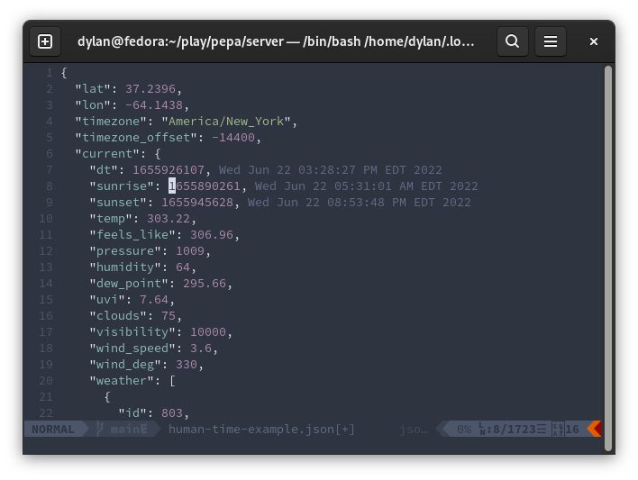

# nvim-human-time

Display timestamps in human-readable time



## About

Full disclosure: I don't actually know what I'm doing.  This codebase is
borrowed almost completely from
[vim-hexokinase](https://github.com/RRethy/vim-hexokinase) with lots of lines
removed and a few things changed.

The plugin leverages unix commands such as `sed`, `grep`, and `date` to
identify and convert timestamps into a human-readable format.

There are no customization options.

## Requirements

- Neovim 0.3.2 or greater

This has been tested with bash on Linux and MacOS.

## Installation

```vim
" vim-plug
Plug 'dsem/nvim-human-time'

" minpac
call minpac#add('dsem/nvim-human-time')

" dein
call dein#add('dsem/nvim-human-time')

" etc.
```

## Commands

| Command  | Description  |
|---|---|
| **HumanTimeToggle**  | Toggle the date conversions  |
| **HumanTimeTurnOn**  | Turn on date conversions (refresh if already turned on) |
| **HumanTimeTurnOff**  | Turn off the date conversions|

## Full Configuration

See `:help human-time.txt`

## Thanks

Thank you to RRethy for producing `vim-hexokinase`, a very useful plugin
which was used as the basis for this work!
